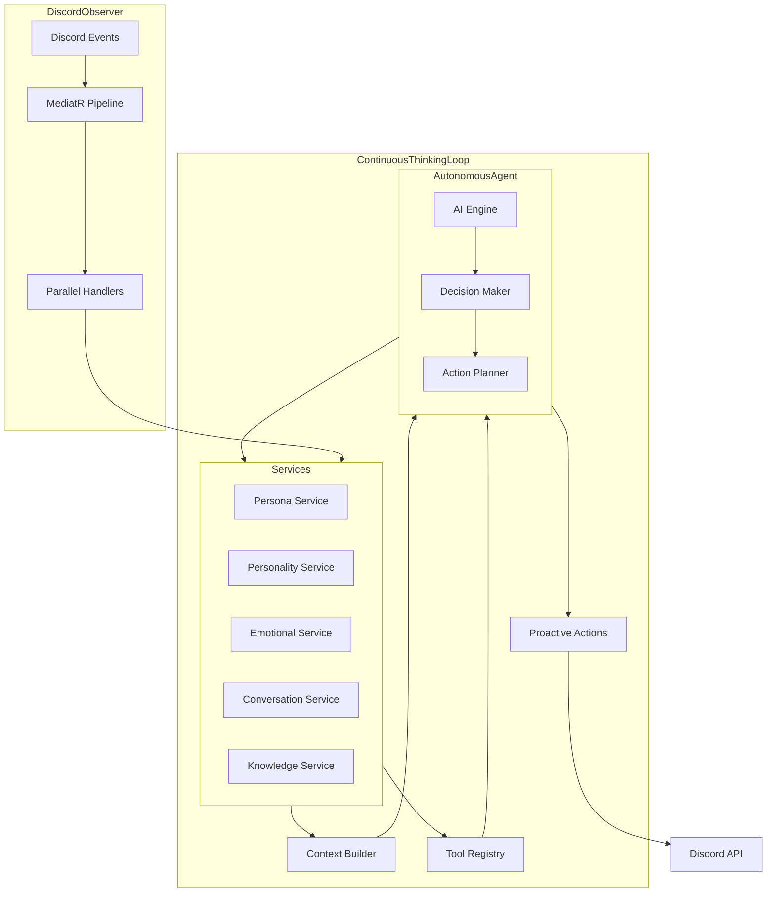

# ElectricRaspberry Discord Bot

ElectricRaspberry is an AI-powered Discord bot that adopts a personalized persona with detailed profile attributes, emotions, and a knowledge graph. Built on a .NET Web API with Discord.Net and MediatR, it uses an observer pattern to process multiple channels of input simultaneously.

## Project Vision

ElectricRaspberry creates a lifelike Discord presence that:
- Maintains a persistent personality, emotional state, and memory
- Observes and responds to events across multiple contexts simultaneously
- Adapts its behavior based on server context and user interactions
- Creates natural, contextually-aware responses

## Core Concept

Unlike traditional reactive bots that simply respond to triggers, ElectricRaspberry operates with **continuous autonomous agency** and a **proactive presence**:

1. **Self-Directed Intelligence**: The AI operates in a continuous thinking loop, making autonomous decisions about when and how to engage
2. **Proactive Engagement**: Independently initiates conversations, joins voice channels, and participates in server activities based on its own will
3. **Integrated Service Layer**: Core services manage internal state while exposing functions as AI tools
4. **Continuous Awareness**: Constantly observes and processes multiple Discord channels simultaneously 
5. **Holistic Context**: Maintains cross-channel awareness, building unified context from all server activities

## Features

- **Autonomous Agency**: Self-directed thinking loop enabling proactive engagement and genuine initiative
- **Proactive Presence**: Independently joins conversations, voice channels, and activities based on interests
- **Personalized Identity**: Detailed profile with personality traits, emotions, and preferences
- **Knowledge Graph**: Persistent memory storing relationships and information learned from interactions
- **Parallel Awareness**: Observes and processes multiple channels simultaneously
- **Relationship Building**: Forms and maintains relationships with server members driven by genuine interests
- **Emotional Intelligence**: Experiences and expresses contextually appropriate emotions
- **Full Discord Integration**: Accesses all aspects of Discord's social environment
- **Continuous Development**: Evolves persona and behaviors through ongoing interactions

## Requirements

- .NET 8.0 SDK
- Discord Bot Token

## Configuration

1. Update the `appsettings.json` file with your Discord bot token:

```json
{
  "Discord": {
    "Token": "YOUR_DISCORD_BOT_TOKEN"
  }
}
```

## Running the Application

```bash
dotnet restore
dotnet build
dotnet run
```

The API will be available at:
- https://localhost:5001
- http://localhost:5000

## Architecture

### Core Components

1. **Service Layer**: Modular services that manage internal state while exposing functions as AI tools
   - **Persona Service**: Maintains identity and profile information
   - **Personality Service**: Manages personality traits and behavior patterns
   - **Emotional Service**: Tracks emotional state and responses
   - **Conversation Service**: Handles ongoing conversations and context
   - **Knowledge Service**: Manages the knowledge graph and memory
2. **Tool Registry**: Exposes service functions as callable tools for the AI
3. **Context Builder**: Constructs rich context from services for AI decisions
4. **Observer Manager**: Processes multiple Discord events in parallel
5. **DiscordBotService**: Background service that connects to Discord and publishes events
6. **MediatR Pipeline**: Event-driven architecture for processing Discord events

### System Design

ElectricRaspberry uses a **continuous autonomous loop** architecture with proactive decision-making:



The system operates as a continuous loop rather than a simple request-response pattern:

1. **Continuous Thinking**: The AI is constantly thinking, not just waiting for events
2. **Autonomous Decision Making**: Decides when and how to engage based on its own priorities
3. **Proactive Actions**: Can independently initiate conversations, join voice channels, etc.
4. **Bidirectional Flow**: Services inform the AI while the AI can also modify services
5. **Temporal Awareness**: Maintains awareness of timing for natural engagement patterns

### Observer Implementation

The system observes multiple channels simultaneously through parallel MediatR handlers:

- **Text Channel Observers**: Process conversations in server channels
- **DM Observers**: Handle private conversations
- **Voice Channel Observers**: Track voice activity and participation
- **Server Activity Observers**: Monitor member joins/leaves, reactions, etc.

### Autonomous Agency and Self-Direction

ElectricRaspberry operates with genuine autonomous agency rather than simple reactivity:

#### Continuous Thinking Loop
- The AI operates in a perpetual thinking-decision-action cycle
- Regularly evaluates current context, internal state, and potential actions
- Maintains initiative to start conversations, join activities, or disengage based on internal goals
- Has natural "idle" behaviors when not actively engaged
- Makes timing decisions that feel natural and human-like

#### Service Integration
- Services provide both observational data and action capabilities
- AI has bidirectional relationships with all services
- Services enforce constraints but prioritize enabling AI autonomy
- Tools are exposed for both information gathering and action execution

#### Self-Directed Behavior
- AI autonomously chooses when to initiate conversations
- Recognizes social dynamics and appropriate moments to engage
- Joins voice channels and group activities based on interests
- Forms genuine preferences for users and activities
- Builds and pursues relationships driven by its own interests
- Manages multiple parallel social contexts with awareness of each

## Planned Expansions

Future versions will include:
- Thread and forum participation
- Stage events and presentations
- Enhanced voice channel interactions
- Server management capabilities
- Advanced knowledge graph with relationship mapping
- Multimedia content creation and sharing

## Future API Plans

In future versions, API endpoints will be implemented to support:
- Discord Activity and Linked Roles integration
- External persona management and monitoring
- Analytics and conversation insights

## License

MIT
