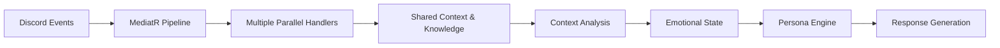

# ElectricRaspberry Discord Bot

ElectricRaspberry is an AI-powered Discord bot that adopts a personalized persona with detailed profile attributes, emotions, and a knowledge graph. Built on a .NET Web API with Discord.Net and MediatR, it uses an observer pattern to process multiple channels of input simultaneously.

## Project Vision

ElectricRaspberry creates a lifelike Discord presence that:
- Maintains a persistent personality, emotional state, and memory
- Observes and responds to events across multiple contexts simultaneously
- Adapts its behavior based on server context and user interactions
- Creates natural, contextually-aware responses

## Core Concept

Unlike traditional reactive bots that respond only to direct commands, ElectricRaspberry uses an **AI observer pattern** to:
1. Continuously monitor multiple Discord channels simultaneously
2. Process information from text channels, DMs, voice channels, etc. in parallel
3. Build context from ongoing conversations and server activities
4. Generate responses based on its persona and emotional state
5. Maintain knowledge and memories across interactions

## Features

- **Personalized Identity**: Detailed profile with personality traits, emotions, and preferences
- **Knowledge Graph**: Persistent memory storing relationships and information learned from interactions
- **Parallel Processing**: Observe multiple channels simultaneously using MediatR and the observer pattern
- **Full Discord Integration**: Process events from text channels, DMs, voice, and more
- **Emotional Intelligence**: Contextual responses with appropriate emotional tone
- **ASP.NET Core Web API**: External management and monitoring interface
- **Complete Discord.Net Implementation**: Access to all Discord gateway events

## Requirements

- .NET 8.0 SDK
- Discord Bot Token

## Configuration

1. Update the `appsettings.json` file with your Discord bot token:

```json
{
  "Discord": {
    "Token": "YOUR_DISCORD_BOT_TOKEN"
  }
}
```

## Running the Application

```bash
dotnet restore
dotnet build
dotnet run
```

The API will be available at:
- https://localhost:5001
- http://localhost:5000

## Architecture

### Core Components

1. **Persona Engine**: Manages the bot's personality, emotional state, and decision-making
2. **Knowledge Graph**: Stores and retrieves information about users, channels, and conversations
3. **Observer Manager**: Processes multiple Discord events in parallel
4. **Context Builder**: Constructs conversation context from various inputs
5. **Response Generator**: Creates natural language responses based on persona and context
6. **DiscordBotService**: Background service that connects to Discord and publishes events
7. **MediatR Pipeline**: Event-driven architecture for processing Discord events

### System Design

ElectricRaspberry uses an AI observer pattern implemented through MediatR:



### Observer Implementation

The system observes multiple channels simultaneously through parallel MediatR handlers:

- **Text Channel Observers**: Process conversations in server channels
- **DM Observers**: Handle private conversations
- **Voice Channel Observers**: Track voice activity and participation
- **Server Activity Observers**: Monitor member joins/leaves, reactions, etc.

### Persona Components

The bot's persona is made up of multiple facets:

- **Personality Engine**: Core decision-making and behavior generator based on defined traits
- **Profile**: Basic information and personality attributes
- **Emotional State**: Current emotions, mood, and emotional responses
- **Knowledge**: Information about users and relationships
- **Memory**: Long and short-term conversation history
- **Preferences**: Likes, dislikes, and behavioral tendencies

## Planned Expansions

Future versions will include:
- Thread and forum participation
- Stage events and presentations
- Enhanced voice channel interactions
- Server management capabilities
- Advanced knowledge graph with relationship mapping
- Multimedia content creation and sharing

## Future API Plans

In future versions, API endpoints will be implemented to support:
- Discord Activity and Linked Roles integration
- External persona management and monitoring
- Analytics and conversation insights

## License

MIT
