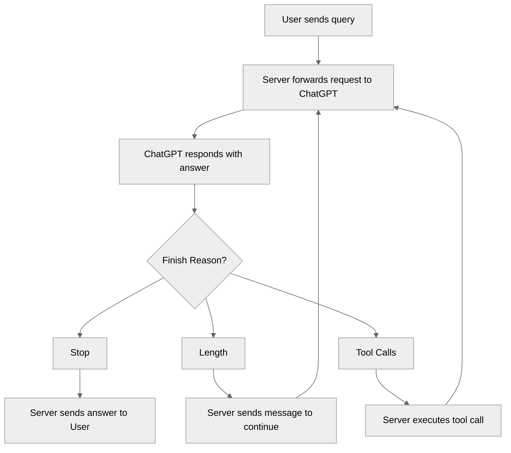
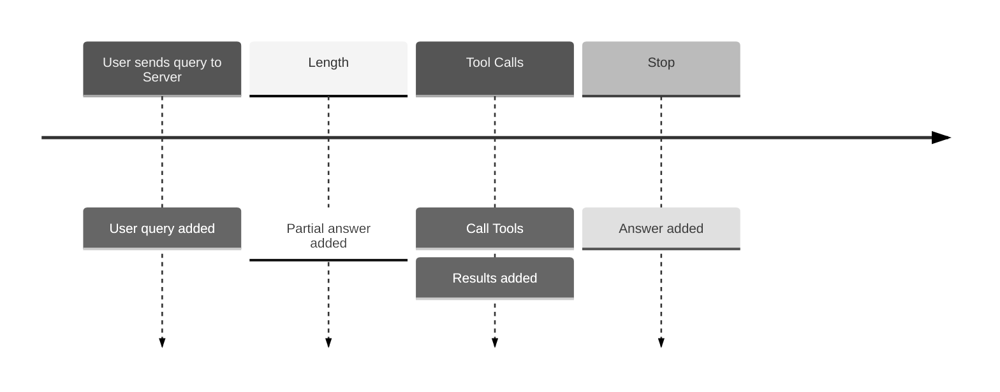

# Electric Raspberry
Introducing Electric Raspberry: a robust and efficient C# minimal API backend, designed for high-performance web applications.

---

## Table of Contents
- [Introduction](#introduction)
- [Architecture](#architecture)
- [Features](#features)
- [Installation](#installation)
- [Usage](#usage)
- [Documentation](#documentation)
- [Support and Feedback](#support-and-feedback)
- [License](#license)
- [Acknowledgements](#acknowledgements)

---

# Architecture

## Orchestration

The process flow of a query orchestration system involving an a browser, server and ChatGPT.

## Chat History

The Chat history is updated via the following events.

