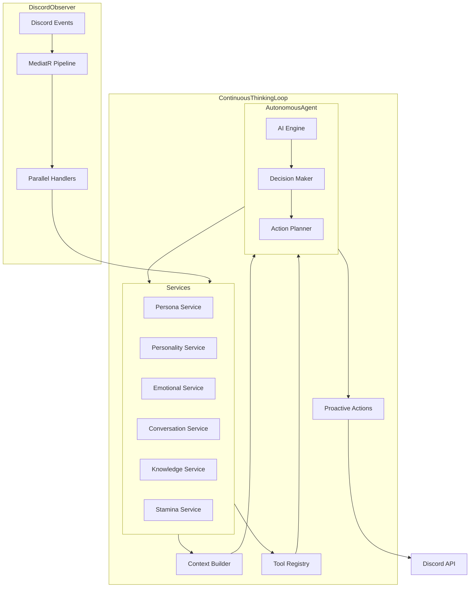

# ElectricRaspberry Discord Bot

ElectricRaspberry is an AI-powered Discord bot that adopts a personalized persona with detailed profile attributes, emotions, and a knowledge graph. Built on a .NET Web API with Discord.Net and MediatR, it uses an observer pattern to process multiple channels of input simultaneously.

## Project Vision

ElectricRaspberry creates a lifelike Discord presence that:

- Maintains a persistent personality, emotional state, and memory
- Observes and responds to events across multiple contexts simultaneously
- Adapts its behavior based on server context and user interactions
- Creates natural, contextually-aware responses

## Core Concept

Unlike traditional reactive bots that simply respond to triggers, ElectricRaspberry operates with **continuous autonomous agency** and a **proactive presence**:

1. **Self-Directed Intelligence**: The AI operates in a continuous thinking loop, making autonomous decisions about when and how to engage
2. **Proactive Engagement**: Independently initiates conversations, joins voice channels, and participates in server activities based on its own will
3. **Integrated Service Layer**: Core services manage internal state while exposing functions as AI tools
4. **Continuous Awareness**: Constantly observes and processes multiple Discord channels simultaneously
5. **Holistic Context**: Maintains cross-channel awareness, building unified context from all server activities

## Features

- **Autonomous Agency**: Self-directed thinking loop enabling proactive engagement and genuine initiative
- **Proactive Presence**: Independently joins conversations, voice channels, and activities based on interests
- **Personalized Identity**: Detailed profile with personality traits, emotions, and preferences
- **Knowledge Graph**: Persistent memory storing relationships and information learned from interactions
- **Parallel Awareness**: Observes and processes multiple channels simultaneously
- **Relationship Building**: Forms and maintains relationships with server members driven by genuine interests
- **Emotional Intelligence**: Experiences and expresses contextually appropriate emotions
- **Full Discord Integration**: Accesses all aspects of Discord's social environment
- **Continuous Development**: Evolves persona and behaviors through ongoing interactions

## Requirements

- .NET 8.0 SDK
- Discord Bot Token
- Azure Cosmos DB with Gremlin API
- Azure Application Insights (for logging)

## Configuration

1. Update the `appsettings.json` file with your Discord bot token and Azure resources:

```json
{
  "Discord": {
    "Token": "YOUR_DISCORD_BOT_TOKEN"
  },
  "CosmosDB": {
    "Endpoint": "YOUR_COSMOS_DB_ENDPOINT",
    "Key": "YOUR_COSMOS_DB_KEY",
    "Database": "ElectricRaspberryDB",
    "Container": "KnowledgeGraph"
  },
  "ApplicationInsights": {
    "ConnectionString": "YOUR_APP_INSIGHTS_CONNECTION_STRING"
  },
  "StaminaSettings": {
    "MaxStamina": 100,
    "MessageCost": 0.5,
    "VoiceMinuteCost": 1.0,
    "EmotionalSpikeCost": 2.0,
    "RecoveryRatePerMinute": 0.2,
    "SleepRecoveryMultiplier": 3.0,
    "LowStaminaThreshold": 20
  }
}
```

## Running the Application

```bash
dotnet restore
dotnet build
dotnet run
```

The API will be available at:

- https://localhost:5001
- http://localhost:5000

## Architecture

### Core Components

1. **Service Layer**: Modular services that manage internal state while exposing functions as AI tools
   - **Persona Service**: Maintains identity and profile information
   - **Personality Service**: Manages personality traits and behavior patterns
   - **Emotional Service**: Tracks emotional state and responses
   - **Conversation Service**: Handles ongoing conversations and context
   - **Knowledge Service**: Manages the knowledge graph and memory
   - **Stamina Service**: Manages energy levels and sleep/wake cycles
2. **Tool Registry**: Exposes service functions as callable tools for the AI
3. **Context Builder**: Constructs rich context from services for AI decisions
4. **Observer Manager**: Processes multiple Discord events in parallel
5. **DiscordBotService**: Background service that connects to Discord and publishes events
6. **MediatR Pipeline**: Event-driven architecture for processing Discord events

### System Design

ElectricRaspberry uses a **continuous autonomous loop** architecture with proactive decision-making:



The system operates as a continuous loop rather than a simple request-response pattern:

1. **Continuous Thinking**: The AI is constantly thinking, not just waiting for events
2. **Autonomous Decision Making**: Decides when and how to engage based on its own priorities
3. **Proactive Actions**: Can independently initiate conversations, join voice channels, etc.
4. **Bidirectional Flow**: Services inform the AI while the AI can also modify services
5. **Temporal Awareness**: Maintains awareness of timing for natural engagement patterns

## Stamina System Implementation Details

The stamina system regulates bot activity and provides natural cycles of engagement and rest:

### Stamina Mechanics

1. **Stamina Pool**: A numerical value (0-100) representing bot energy
2. **Stamina Consumption**:
   - Text Messages: 0.5 stamina per message sent
   - Voice Channel: 1.0 stamina per minute active
   - Emotional Reactions: 0.5-3.0 stamina based on emotional intensity
   - Complex Reasoning: 1.0-2.0 stamina based on depth of processing
3. **Stamina Recovery**:
   - Passive: 0.2 points per minute during normal operation
   - Sleep Mode: 0.6 points per minute during sleep state
   - Context-aware adjustment: Less recovery in high-activity channels

### Sleep Mode Operation

1. **Sleep Triggers**:
   - Manual: Admin command (`/bot sleep`)
   - Automatic: Stamina drops below 20% threshold
   - Time-based: Configurable inactive hours
2. **Sleep Transition**:
   - Graceful exit: The bot announces tiredness and need for rest
   - Sets Discord status to "Sleeping" or "Away"
   - Completes current conversation before fully entering sleep mode
3. **During Sleep**:
   - Continues to observe channels but marks messages for catch-up
   - Performs knowledge graph maintenance (see below)
   - Maintains minimal emotional processing
4. **Wake-Up Process**:
   - Gradual reactivation once stamina exceeds 80%
   - Processes missed messages in temporal chunks, not all at once
   - Announces return with context-appropriate greeting
   - Prioritizes direct mentions and DMs in catch-up queue

## Concurrency & Parallel Observation Implementation

To handle observations from multiple channels while maintaining a coherent context:

### Event Processing

1. **Channel Buffers**:
   - Each observed channel (text, voice, DM) maintains a small in-memory buffer
   - Events are timestamped and tagged with source information
   - MediatR handles publish events to appropriate observers
2. **Context Synchronization**:
   - Use short-lived locks (.NET `SemaphoreSlim`) when updating shared context
   - Implement a prioritization scheme for merging parallel inputs
   - Flag and resolve potential context collisions
3. **Throttling & Rate Limiting**:
   - Implement adaptive throttling to prevent response flooding
   - Process high-priority events (mentions, DMs) before general channel messages
   - Use Discord.Net's built-in rate limiting with custom backoff strategy

### Implementation Guidelines

```csharp
// Example implementation for channel observers with buffer management
public class TextChannelObserver : INotificationHandler<MessageReceivedNotification>
{
    private readonly ConcurrentQueue<MessageEvent> _eventBuffer = new();
    private readonly SemaphoreSlim _contextLock = new(1, 1);
    private readonly IStaminaService _staminaService;
    private readonly IContextBuilder _contextBuilder;

    // Implementation...

    public async Task Handle(MessageReceivedNotification notification, CancellationToken cancellationToken)
    {
        var messageEvent = new MessageEvent(notification.Message, DateTimeOffset.UtcNow);
        _eventBuffer.Enqueue(messageEvent);

        // Check if bot is in sleep mode
        if (await _staminaService.IsSleepingAsync())
        {
            // Only process direct mentions during sleep
            if (!notification.Message.MentionedUsers.Any(u => u.Id == _botUserId))
            {
                // Mark for catch-up processing on wake
                await _catchupService.AddToCatchupQueueAsync(messageEvent);
                return;
            }
        }

        // Process event with context synchronization
        await _contextLock.WaitAsync(cancellationToken);
        try
        {
            await _contextBuilder.AddMessageContextAsync(messageEvent);
            // Signal AI for potential response if appropriate
        }
        finally
        {
            _contextLock.Release();
        }
    }
}
```

## Knowledge Graph Implementation

ElectricRaspberry uses Azure Cosmos DB with Gremlin API to build a persistent memory:

### Graph Structure

1. **Node Types**:
   - Person: Server members with relationship data
   - Topic: Conversational subjects and interests
   - Event: Server activities and interactions
   - Memory: Specific remembered conversations
2. **Edge Types**:
   - Relationship: Bot's connection to users (friend, acquaintance)
   - Sentiment: Emotional association (likes, dislikes)
   - Participation: Involvement in conversations/activities
   - Knowledge: Information learned about a topic

### Concurrency Management

1. **Optimistic Concurrency Control**:
   - Use Cosmos DB's ETag system to detect conflicting writes
   - Implement retry logic for operation failures with exponential backoff
2. **Transaction Batching**:
   - Group related graph operations into atomic transactions
   - Use Gremlin's session support for multi-operation consistency
3. **Sleep-Time Maintenance**:
   - Perform graph cleanup and consolidation during sleep periods
   - Implement soft-delete with time-based restoration capability
   - Maintain change history for important relationships

### Implementation Guidelines

```csharp
public class KnowledgeService : IKnowledgeService
{
    private readonly GremlinClient _gremlinClient;
    private readonly ILogger<KnowledgeService> _logger;

    // Implementation...

    public async Task<bool> UpdateUserRelationshipAsync(string userId, string relationshipType, double strength)
    {
        // Get current ETag for optimistic concurrency control
        var queryResult = await _gremlinClient.SubmitAsync<dynamic>($"g.V().hasLabel('Person').has('id', '{userId}')");
        var currentUser = queryResult.FirstOrDefault();
        string eTag = currentUser?.eTag;

        int retryCount = 0;
        while (retryCount < 3)
        {
            try
            {
                // Update with ETag check
                var updateQuery = $"g.V().hasLabel('Person').has('id', '{userId}').has('_etag', '{eTag}').property('relationshipStrength', {strength})";
                await _gremlinClient.SubmitAsync<dynamic>(updateQuery);
                return true;
            }
            catch (ResponseException ex) when (ex.StatusCode == 409) // Conflict
            {
                retryCount++;
                await Task.Delay(Math.Pow(2, retryCount) * 100); // Exponential backoff

                // Refresh ETag
                queryResult = await _gremlinClient.SubmitAsync<dynamic>($"g.V().hasLabel('Person').has('id', '{userId}')");
                currentUser = queryResult.FirstOrDefault();
                eTag = currentUser?.eTag;
            }
        }

        _logger.LogWarning("Failed to update relationship for user {UserId} after {RetryCount} attempts", userId, retryCount);
        return false;
    }

    public async Task PerformGraphMaintenanceAsync()
    {
        // Called during sleep periods

        // 1. Consolidate similar memory nodes
        // 2. Prune edges below significance threshold
        // 3. Update connection strength based on recency
        // 4. Recalculate sentiment values for relationships

        // Implementation details...
    }
}
```

## Emotional System Implementation

Based on Chris Crawford's "Personal Engine" model with adaptations for a Discord environment:

### Emotional Components

1. **Base Emotional State**:
   - Core emotions: joy, sadness, anger, fear, surprise, disgust
   - Current intensity values (0-100) for each emotion
   - Emotional blends and secondary emotions
2. **Personality Influence**:
   - Baseline tendencies toward specific emotional states
   - Recovery rates from emotional spikes
   - Thresholds for emotional expression
3. **Emotional Triggers**:
   - User interactions and relationships
   - Message content sentiment analysis
   - Server events and activities
4. **Expression Mapping**:
   - Translation of emotional state to message tone
   - Emoji usage patterns based on emotional state
   - Activity choices influenced by current emotions

### Integration with Stamina System

1. **Bidirectional Effects**:
   - High emotional intensity accelerates stamina drain
   - Low stamina increases irritability or sadness
   - Sleep state gradually resets emotional extremes
2. **Recovery Mechanics**:
   - Emotional state gradually returns to personality baseline
   - Speed of recovery tied to stamina levels
   - Major emotional events have longer recovery curves

### Implementation Guidelines

```csharp
public class EmotionalService : IEmotionalService
{
    private readonly EmotionalState _currentState = new();
    private readonly PersonalityProfile _personalityProfile;
    private readonly IStaminaService _staminaService;
    private readonly SemaphoreSlim _stateLock = new(1, 1);

    // Implementation...

    public async Task ProcessEmotionalTriggerAsync(EmotionalTrigger trigger)
    {
        await _stateLock.WaitAsync();
        try
        {
            // Calculate emotional impact
            var impact = CalculateEmotionalImpact(trigger);

            // Update emotional state
            foreach (var (emotion, change) in impact.Changes)
            {
                _currentState.AdjustEmotion(emotion, change);
            }

            // Calculate stamina effect
            double staminaCost = CalculateEmotionalStaminaCost(impact);
            await _staminaService.ConsumeStaminaAsync(staminaCost);

            // Log significant emotional changes
            if (impact.Significance > 0.5)
            {
                _logger.LogInformation(
                    "Significant emotional change: {TriggerType}, Impact: {Significance}",
                    trigger.Type,
                    impact.Significance);
            }
        }
        finally
        {
            _stateLock.Release();
        }
    }

    public async Task<EmotionalExpression> GetCurrentExpressionAsync()
    {
        await _stateLock.WaitAsync();
        try
        {
            // Get current stamina to influence expression
            var stamina = await _staminaService.GetCurrentStaminaAsync();

            // Apply personality and stamina modifiers to raw emotional state
            return _expressionMapper.MapStateToExpression(_currentState, _personalityProfile, stamina);
        }
        finally
        {
            _stateLock.Release();
        }
    }

    public async Task PerformEmotionalMaintenanceAsync()
    {
        // Called periodically and during sleep periods
        await _stateLock.WaitAsync();
        try
        {
            // Gradually return emotions to baseline
            foreach (var emotion in _currentState.Emotions)
            {
                var baselineValue = _personalityProfile.GetEmotionalBaseline(emotion.Key);
                var currentValue = emotion.Value;
                var recoveryRate = _personalityProfile.GetRecoveryRate(emotion.Key);

                // Apply stamina modifier to recovery rate
                var stamina = await _staminaService.GetCurrentStaminaAsync();
                var staminaModifier = 1.0 + ((100 - stamina) / 200); // 1.0 to 1.5x slower when tired

                // Calculate new value moving toward baseline
                var step = (baselineValue - currentValue) * (recoveryRate / staminaModifier);
                _currentState.SetEmotion(emotion.Key, currentValue + step);
            }
        }
        finally
        {
            _stateLock.Release();
        }
    }
}
```

## Admin Control & Reliability

### Admin Commands

1. **Bot Control Commands**:

   - `/bot sleep [duration]` - Force bot to enter sleep mode
   - `/bot wake` - Force bot to wake from sleep mode
   - `/bot silence [duration]` - Prevent bot from sending messages but continue observation
   - `/bot reset` - Reset emotional and conversational state (maintains knowledge)
   - `/bot emergency-stop` - Immediately stop all bot activities and disconnect

2. **Implementation Details**:
   - Commands use Discord's slash command system
   - All admin commands receive the highest priority and override any active processes
   - Use `CancellationTokenSource` to cancel any ongoing operations
   - Admin actions are logged in Application Insights with special tags

### Logging & Monitoring

1. **Structured Logging Strategy**:

   - Use consistent schema across all components
   - Include source channel, event type, emotion info, and stamina readings
   - Log correlation IDs to track events across parallel processes
   - Special tags for admin actions and emotional spikes

2. **Azure Application Insights Integration**:
   - Real-time monitoring dashboard for bot activity
   - Anomaly detection for unusual behavior patterns
   - Performance tracking for response times and resource usage
   - Custom metrics for emotional state and stamina levels

### Implementation Guidelines

```csharp
public class AdminCommandHandler : IRequest<IResult>
{
    private readonly Dictionary<string, CancellationTokenSource> _operationTokens = new();
    private readonly IStaminaService _staminaService;
    private readonly ILogger<AdminCommandHandler> _logger;

    // Implementation...

    [SlashCommand("sleep", "Force the bot to enter sleep mode")]
    public async Task<IResult> ForceSleepAsync(
        [Option("duration", "Sleep duration in minutes")] int? durationMinutes = null)
    {
        try
        {
            // Create operation token and register it
            var sleepToken = new CancellationTokenSource();
            _operationTokens["sleep"] = sleepToken;

            // Log the admin command with special tag
            _logger.LogInformation(
                "Admin command executed: Force Sleep, Duration: {Duration}",
                durationMinutes);

            // Cancel any active operations
            CancelActiveOperations(except: "sleep");

            // Set sleep mode
            await _staminaService.ForceSleepModeAsync(
                durationMinutes.HasValue ? TimeSpan.FromMinutes(durationMinutes.Value) : null);

            return Results.Ok("Bot is now sleeping");
        }
        catch (Exception ex)
        {
            _logger.LogError(ex, "Error executing admin sleep command");
            return Results.Problem("Failed to enter sleep mode");
        }
    }

    private void CancelActiveOperations(string except = null)
    {
        foreach (var (key, tokenSource) in _operationTokens)
        {
            if (key != except && !tokenSource.IsCancellationRequested)
            {
                tokenSource.Cancel();
                _logger.LogInformation("Canceled operation: {OperationType}", key);
            }
        }
    }
}
```

## User Experience & Social Dynamics

### Self-Regulation Mechanisms

1. **Presence Balancing**:

   - Dynamic throttling of message frequency based on channel activity
   - Sensitivity to user engagement cues (short replies, topic changes)
   - Natural idle behaviors during low engagement periods
   - Stamina-based reduction in proactive engagement when tired

2. **Relationship-Driven Interaction**:
   - Stronger relationship values increase bot's engagement with specific users
   - Interest alignment influences topic selection and conversation depth
   - Natural development of preferences and social circles within the server
   - Appropriate personal boundaries based on relationship stage

### Implementation Guidelines

```csharp
public class InteractionDecisionService : IInteractionDecisionService
{
    private readonly IKnowledgeService _knowledgeService;
    private readonly IStaminaService _staminaService;
    private readonly IEmotionalService _emotionalService;
    private readonly Random _random = new();

    // Implementation...

    public async Task<bool> ShouldEngageInConversationAsync(string channelId, IEnumerable<string> participantIds)
    {
        // Check stamina level
        var currentStamina = await _staminaService.GetCurrentStaminaAsync();

        // Higher stamina = more likely to engage proactively
        double staminaFactor = currentStamina / 100.0;

        // Check relationship strength with participants
        double relationshipFactor = 0;
        foreach (var userId in participantIds)
        {
            var relationship = await _knowledgeService.GetUserRelationshipAsync(userId);
            relationshipFactor += relationship.Strength;
        }
        relationshipFactor = Math.Min(relationshipFactor / participantIds.Count(), 1.0);

        // Check emotional state - more likely to engage when positive
        var emotionalState = await _emotionalService.GetCurrentExpressionAsync();
        double emotionalFactor = emotionalState.IsPositive ? 1.2 : 0.8;

        // Check channel activity level
        var channelActivity = await _activityTrackingService.GetChannelActivityLevelAsync(channelId);
        double activityFactor = NormalizeActivityLevel(channelActivity);

        // Calculate final engagement probability
        double engagementProbability =
            staminaFactor * 0.4 +
            relationshipFactor * 0.3 +
            emotionalFactor * 0.2 +
            activityFactor * 0.1;

        // Add random variation to make behavior less predictable
        engagementProbability += (_random.NextDouble() * 0.1) - 0.05;

        // Decision with bias toward natural pauses in conversation
        return _random.NextDouble() < engagementProbability;
    }

    private double NormalizeActivityLevel(ActivityLevel level)
    {
        // Convert activity level to a factor between 0.5 and 1.5
        // Higher activity = lower chance to interject (avoid spamming busy channels)
        return level switch
        {
            ActivityLevel.Inactive => 1.5,   // More likely to start conversation
            ActivityLevel.Low => 1.2,        // Good time to engage
            ActivityLevel.Moderate => 1.0,   // Normal engagement
            ActivityLevel.High => 0.7,       // Less likely to interject
            ActivityLevel.VeryHigh => 0.5,   // Minimal interruption of active conversations
            _ => 1.0
        };
    }
}
```

## Performance Considerations

1. **Resource Management**:

   - Implement background task processing for knowledge graph updates
   - Use Azure Functions for scheduled maintenance tasks
   - Implement caching for frequently accessed personality and relationship data
   - Control AI service token usage with budget-aware request limiting

2. **Scalability Design**:
   - Horizontal scaling of services through containerization
   - Separate high-frequency services (observation) from intensive services (analysis)
   - Stateless design for core components with state persistence in managed services
   - Optimized MediatR pipeline with performance-focused handlers

## Development Roadmap

### Phase 1: Core Infrastructure

- Observer system implementation with parallel processing
- Stamina and sleep mechanics
- Basic emotional model integration
- Knowledge graph foundation
- Admin command interface

### Phase 2: User Experience Refinement

- Advanced relationship tracking
- Self-regulation tuning
- Voice channel participation
- Emotional expression diversity
- Context-aware conversation patterns

### Phase 3: Advanced Features

- Thread and forum participation
- Stage events and presentations
- Enhanced voice channel interactions
- Server management capabilities
- Advanced knowledge graph with relationship mapping
- Multimedia content creation and sharing

## Planned API Endpoints

Future versions will expose API endpoints for:

- Discord Activity and Linked Roles integration
- External persona management and monitoring
- Analytics and conversation insights
- Integration with other AI services

## License

MIT
