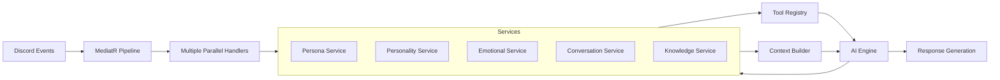

# ElectricRaspberry Discord Bot

ElectricRaspberry is an AI-powered Discord bot that adopts a personalized persona with detailed profile attributes, emotions, and a knowledge graph. Built on a .NET Web API with Discord.Net and MediatR, it uses an observer pattern to process multiple channels of input simultaneously.

## Project Vision

ElectricRaspberry creates a lifelike Discord presence that:
- Maintains a persistent personality, emotional state, and memory
- Observes and responds to events across multiple contexts simultaneously
- Adapts its behavior based on server context and user interactions
- Creates natural, contextually-aware responses

## Core Concept

Unlike traditional reactive bots that respond only to direct commands, ElectricRaspberry uses an **AI observer pattern** with a unique integrated architecture:

1. **Integrated Service Layer**: Core services (Persona, Personality, Conversations, etc.) manage their internal state while exposing functions as AI tools
2. **Dual Management Approach**: Testing both system-managed and AI self-regulated states to determine optimal architecture
3. **Context-Driven Decision Making**: AI accesses internal bot state through Context Builder to make informed responses
4. **Parallel Channel Processing**: Monitor and process multiple Discord channels simultaneously
5. **Cross-Channel Awareness**: Build unified context from text channels, DMs, voice channels, and other sources

## Features

- **Personalized Identity**: Detailed profile with personality traits, emotions, and preferences
- **Knowledge Graph**: Persistent memory storing relationships and information learned from interactions
- **Parallel Processing**: Observe multiple channels simultaneously using MediatR and the observer pattern
- **Full Discord Integration**: Process events from text channels, DMs, voice, and more
- **Emotional Intelligence**: Contextual responses with appropriate emotional tone
- **ASP.NET Core Web API**: External management and monitoring interface
- **Complete Discord.Net Implementation**: Access to all Discord gateway events

## Requirements

- .NET 8.0 SDK
- Discord Bot Token

## Configuration

1. Update the `appsettings.json` file with your Discord bot token:

```json
{
  "Discord": {
    "Token": "YOUR_DISCORD_BOT_TOKEN"
  }
}
```

## Running the Application

```bash
dotnet restore
dotnet build
dotnet run
```

The API will be available at:
- https://localhost:5001
- http://localhost:5000

## Architecture

### Core Components

1. **Service Layer**: Modular services that manage internal state while exposing functions as AI tools
   - **Persona Service**: Maintains identity and profile information
   - **Personality Service**: Manages personality traits and behavior patterns
   - **Emotional Service**: Tracks emotional state and responses
   - **Conversation Service**: Handles ongoing conversations and context
   - **Knowledge Service**: Manages the knowledge graph and memory
2. **Tool Registry**: Exposes service functions as callable tools for the AI
3. **Context Builder**: Constructs rich context from services for AI decisions
4. **Observer Manager**: Processes multiple Discord events in parallel
5. **DiscordBotService**: Background service that connects to Discord and publishes events
6. **MediatR Pipeline**: Event-driven architecture for processing Discord events

### System Design

ElectricRaspberry uses an integrated service architecture with AI tools:



### Observer Implementation

The system observes multiple channels simultaneously through parallel MediatR handlers:

- **Text Channel Observers**: Process conversations in server channels
- **DM Observers**: Handle private conversations
- **Voice Channel Observers**: Track voice activity and participation
- **Server Activity Observers**: Monitor member joins/leaves, reactions, etc.

### Service Integration and AI Self-Regulation

ElectricRaspberry uses a hybrid approach to state management:

#### Service Responsibilities
- Each service maintains its own internal state and data structures
- Services expose methods as tools the AI can call to query or modify state
- Services contribute to context building by providing state snapshots
- Services implement persistence and data integrity safeguards

#### AI Self-Regulation
- AI can access current state through rich context provided by the Context Builder
- AI can modify state by calling service tools through the Tool Registry
- Both approaches (system-managed state updates and AI self-regulation) will be tested to determine the optimal balance
- AI can analyze its own performance and suggest improvements to its decision-making process

## Planned Expansions

Future versions will include:
- Thread and forum participation
- Stage events and presentations
- Enhanced voice channel interactions
- Server management capabilities
- Advanced knowledge graph with relationship mapping
- Multimedia content creation and sharing

## Future API Plans

In future versions, API endpoints will be implemented to support:
- Discord Activity and Linked Roles integration
- External persona management and monitoring
- Analytics and conversation insights

## License

MIT
