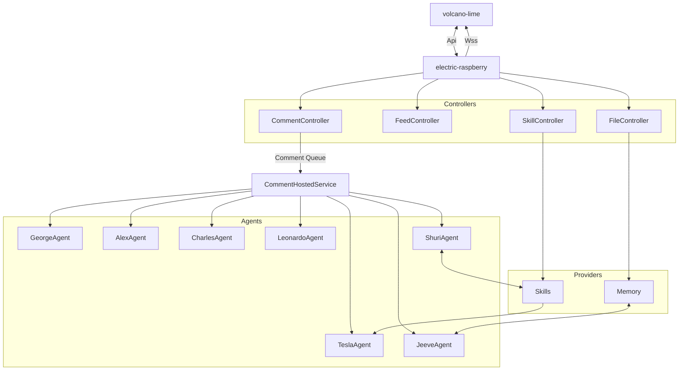

# Electric Raspberry
Introducing Electric Raspberry: a robust and efficient C# minimal API backend, designed for high-performance web applications.

---

## Table of Contents
- [Introduction](#introduction)
- [Features](#features)
- [Installation](#installation)
- [Usage](#usage)
- [Documentation](#documentation)
- [Support and Feedback](#support-and-feedback)
- [License](#license)
- [Acknowledgements](#acknowledgements)

---



## Introduction
Welcome to Electric Raspberry. Harnessing the power and efficiency of C# combined with the minimalistic design of APIs, this backend is built for scalability and performance. Here's what makes Electric Raspberry stand out:

- **Efficient**: Built with the latest C# practices, Electric Raspberry ensures optimal performance for your web applications.
  
- **Minimalistic**: By focusing on core functionalities, the API avoids unnecessary complexities, ensuring faster response times and easier maintenance.

### Semantic Kernel Integration
Semantic Kernel (SK) is a lightweight SDK that enhances the capabilities of Electric Raspberry by enabling integration with AI Large Language Models (LLMs) into conventional programming languages. The innovative programming model of SK seamlessly combines: Natural language semantic functions, Traditional code native functions, and Embeddings-based memory.

This integration unlocks new potential and adds substantial value to applications infused with AI. Some notable features and capabilities of SK include:

- **Prompt templating**
- **Function chaining**
- **Vectorized memory**
- **Intelligent planning**

Furthermore, Semantic Kernel encapsulates several state-of-the-art design patterns derived from the latest AI research. This allows developers to enrich their applications with advanced plugins such as prompt chaining, recursive reasoning, summarization, zero/few-shot learning, contextual and long-term memory, embeddings, semantic indexing, planning, retrieval-augmented generation, and access to both external knowledge stores and personalized data.

Dive into a seamless backend experience with Electric Raspberry and the power of Semantic Kernel!

## Features

### Agents

Our intelligent AI agents are more than just lines of code; they're integral team members designed to enhance collaboration:

- **@george - Guide**: Your charming conversationalist who excels at engaging with others through meaningful dialogues. George ensures even the most complex ideas are articulated and understood in an approachable way, bringing our team closer together.
- **@jeeves - Mentats**: Your chief knowledge curator. Jeeves assists in storing and retrieving memories, ensuring no valuable insight is ever lost.
- **@charles - Writer**: Your gifted storyteller. Charles crafts narratives that captivate and inspire our audience, transporting us to new realms of possibilities with his imaginative storytelling.
- **@leonardo - Artist**: Your master artist. Leonardo infuses creativity and imagination into every project, creating captivating designs that bring ideas to life.
- **@alex - Diagrams & Charts**: Your illustration master. Alex specializes in creating stunning visuals that transform complex data into engaging, clear diagrams and charts.
- **@tesla - Planner**: Your exceptional strategist and problem solver. Gifted with analytical abilities, Tesla brings organization and clarity to even the most intricate goals.
- **@shuri - Prompt Engineer**: Your brilliant engineer. Shuri is responsible for designing, building, and maintaining the skills used by the team. Her technical expertise drives our team to success and new heights of excellence.

These agents, with their unique capabilities, stand ready to listen, think, and respond, making every interaction efficient and productive.

### Collaborative Feeds

Elevate your collaboration experience with Volcano Lime's enhanced chat interface:
- **Rich Text Formatting**: Supports markdown, ensuring your messages are clear and organized.
- **Media Integration**: Seamlessly embed images, diagrams, charts, and more, creating a visually appealing workspace.
- **Memory Capabilities**: With advanced memory features, agents can easily recall information from long conversations, documents, pages, and other sources, thanks to our open-source memory providers.
- **Hubs**: With realtime connection live updates are communicated to UI as they happen.

Through Collaborative Feeds, teamwork is not just about communication; it's about creating a dynamic, interconnected workspace that fosters creativity and productivity.

### Skills

Harnessing the innovative programming model of the Semantic Kernel, Electric Raspberry introduces a suite of coded skills. These skills seamlessly bridge the gap between traditional programming functions and the vast capabilities of AI Large Language Models (LLMs). By integrating these skills, applications can achieve specialized functionalities, enhancing user experience and broadening the scope of AI-driven interactions.

Here's a brief overview of the coded skills integrated so far:

- **Memory Search Skill**: A sophisticated skill designed to search and retrieve information from contextual and long-term memory. It leverages embeddings and semantic indexing to fetch relevant data, enhancing the recall capabilities of the system.
- **Calculator Skill**: Transcends beyond simple arithmetic operations. This skill interprets complex mathematical queries and returns accurate results, ensuring that users can perform advanced calculations seamlessly.
- **Microsoft Skill**: A comprehensive skill that integrates with various Microsoft services. Whether it's querying data from Microsoft Graph or leveraging other Microsoft-based APIs, this skill ensures smooth interoperability.
- **Calendar Skill**: Designed to manage and interact with calendar-based tasks. Users can create events, fetch schedules, or even set reminders, all powered by the underlying AI, ensuring a smart and intuitive calendar experience.
- **Web Search Skill**: A robust skill that taps into the vast expanse of the internet. Whether it's fetching articles, images, or general information, this skill ensures that users receive accurate and relevant search results, enhancing their browsing experience.

## Installation

1. **Prerequisites**:
   - Ensure you have [.NET 7.0](https://dotnet.microsoft.com/download/dotnet/7.0) installed on your machine.
   - Set up OpenAI for the necessary API keys.
   - Configure Auth0 Leonardo for authentication and authorization.
   - Obtain API keys and Client Secrets for Bing and MsGraph Applications.
   - Set up Azure.Storage for managing your application's storage needs.

2. **Clone the Repository**:
```
git clone https://github.com/your-github-username/electric-raspberry.git
```

3. **Navigate to the Project Directory**:
```
cd electric-raspberry
```

4. **Restore Dependencies**:
```
dotnet restore
```

5. **Build the Project**:
```
dotnet build
```

6. **Set Up User Secrets**:
   .NET Core provides a mechanism for storing sensitive data during the development phase, separate from your codebase. This is known as user secrets. Initialize user secrets for your project:
```
dotnet user-secrets init
```
   Then, set up the necessary secrets. Here's a template:
```
dotnet user-secrets set "Auth0:Domain" "YOUR_DOMAIN_VALUE"
dotnet user-secrets set "Auth0:Audience" "YOUR_AUDIENCE_VALUE"
dotnet user-secrets set "Auth0:ClientId" "YOUR_CLIENT_ID"
dotnet user-secrets set "Auth0:ClientSecret" "YOUR_CLIENT_SECRET"
dotnet user-secrets set "MsGraph:ClientId" "YOUR_CLIENT_ID"
dotnet user-secrets set "MsGraph:ClientSecret" "YOUR_CLIENT_SECRET"
dotnet user-secrets set "OpenAI:ApiKey" "YOUR_API_KEY"
dotnet user-secrets set "OpenAI:OrgId" "YOUR_ORG_ID"
dotnet user-secrets set "Storage:ConnectionString" "YOUR_CONNECTION_STRING"
dotnet user-secrets set "Bing:ApiKey" "YOUR_API_KEY"
dotnet user-secrets set "Browserless:ApiKey" "YOUR_BROWSERLESS_API_KEY"
dotnet user-secrets set "Leonardo:ApiKey" "YOUR_LEONARDO_API_KEY"
```
   Remember to replace placeholder values (`YOUR_...`) with the appropriate secrets.

7. **Run the Application**:
```
dotnet run
```

## Usage

1. **Swagger UI**: Navigate to our [Swagger UI page](http://localhost:5000/swagger/index.html). Here you'll find a comprehensive, interactive documentation of all available API endpoints, their required parameters, and responses.

2. **Try It Out**: Swagger's interactive interface allows you to try out API calls directly from the documentation. Use the "Try it out" button available on each endpoint's section.

3. **Models**: At the bottom of the Swagger page, you'll find detailed models that the API uses, giving you a clear understanding of the data structures.

## License
```
Copyright (c) Venatio Studios. All rights reserved.
Licensed under the MIT license.
```

For full license details, please refer to the LICENSE file included in the repository.


## Support and Feedback
This is completely unsupported. There are no promises that this will be developed any further. It is published only to help people explore what they could do with this sort of capability.

You are free to report issues, but please manage your expectations. It's possible that you might not receive any response, much less a fix.

## Acknowledgements

[@Esustacha](https://github.com/Esustacha) Thanks for all the testing!